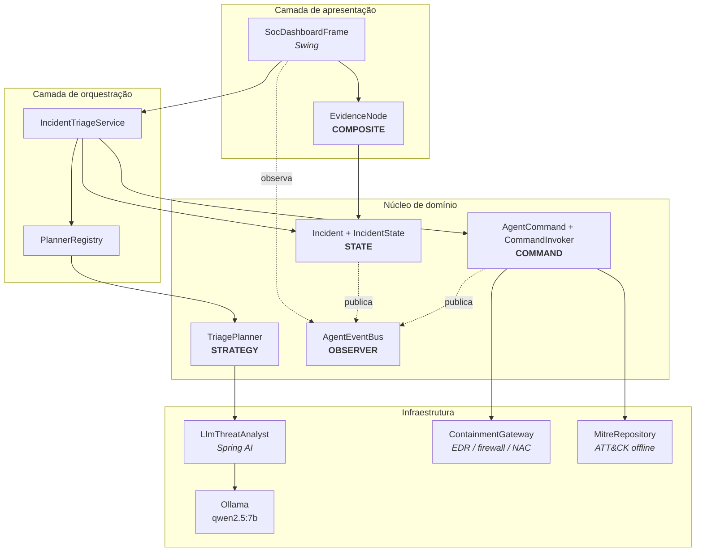
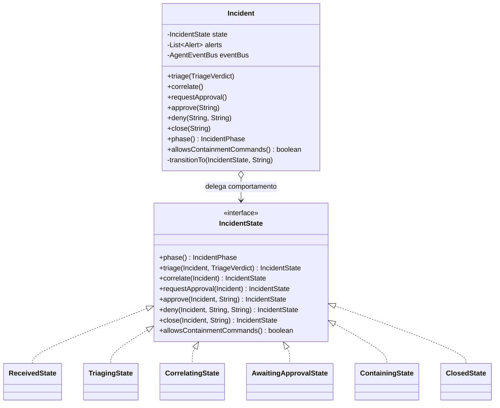
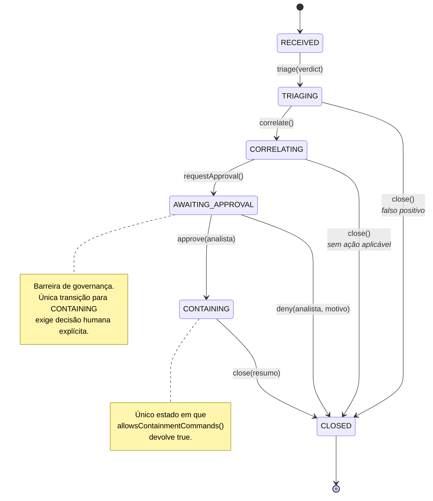
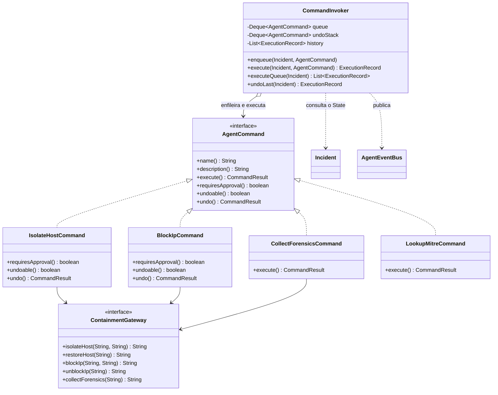
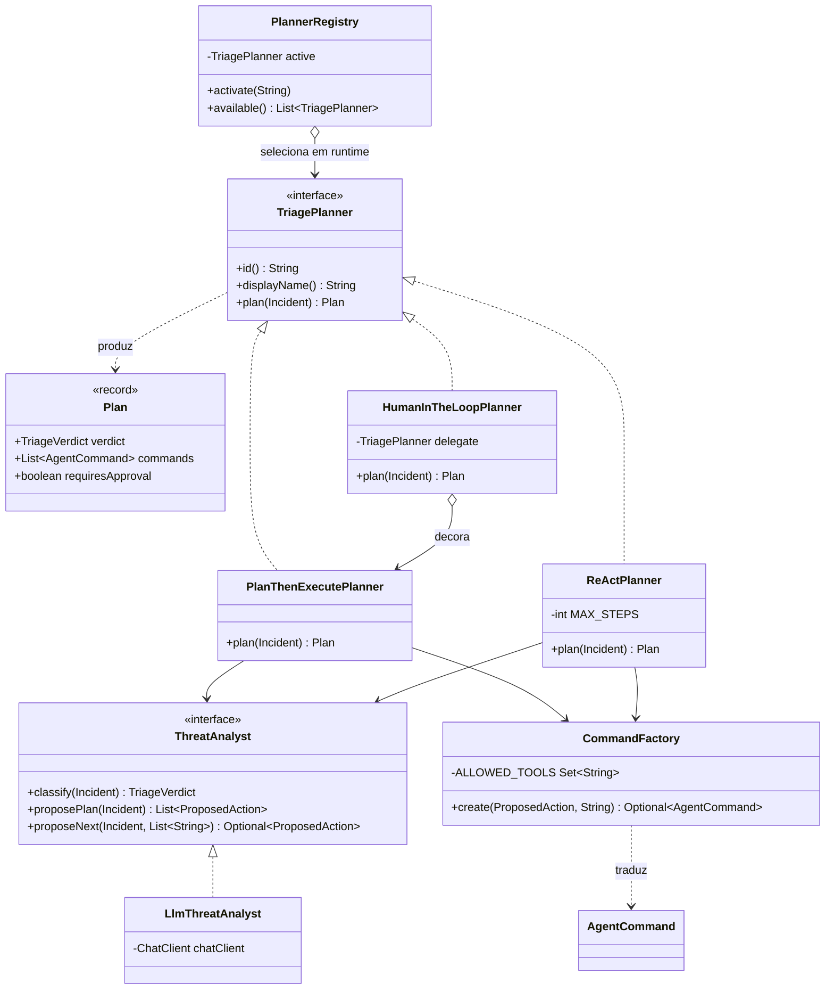
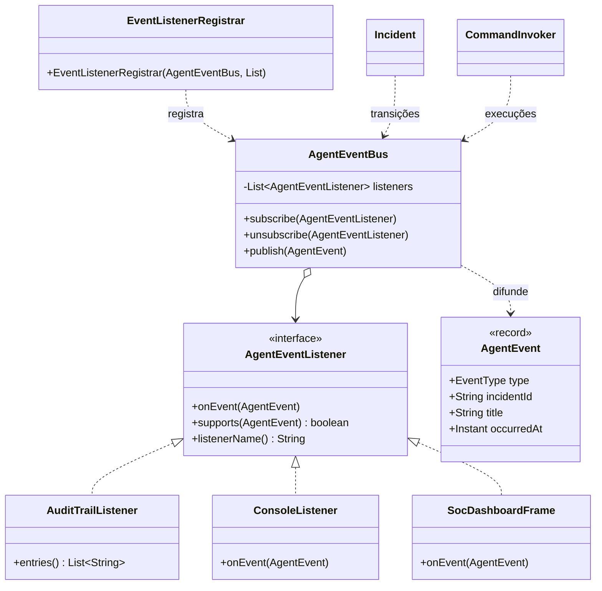
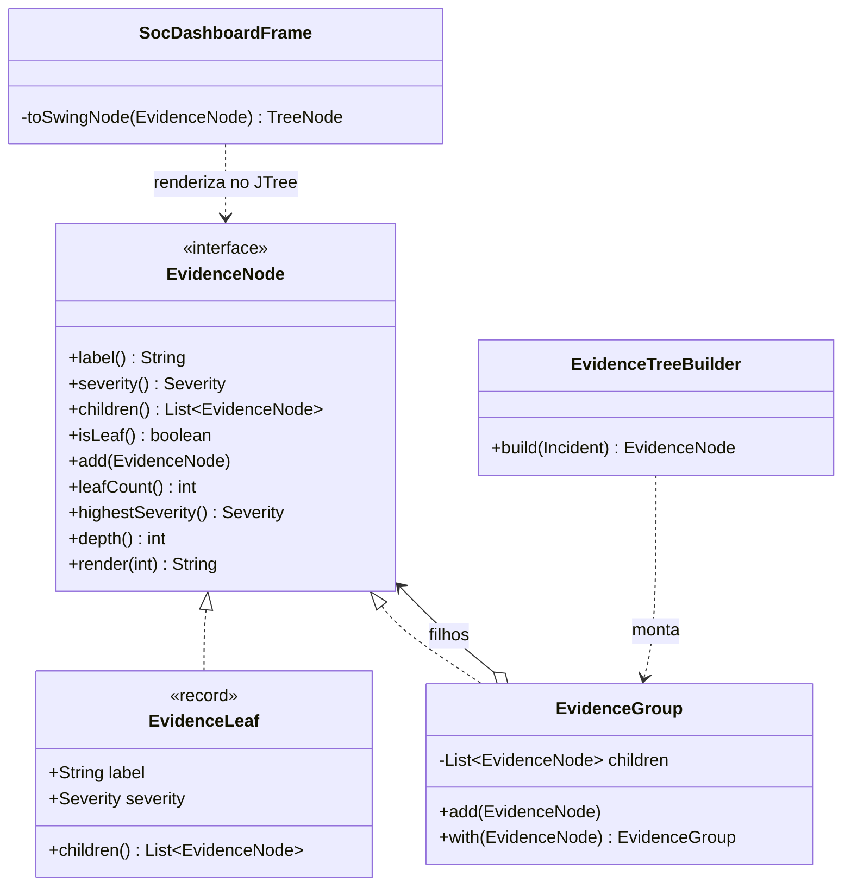
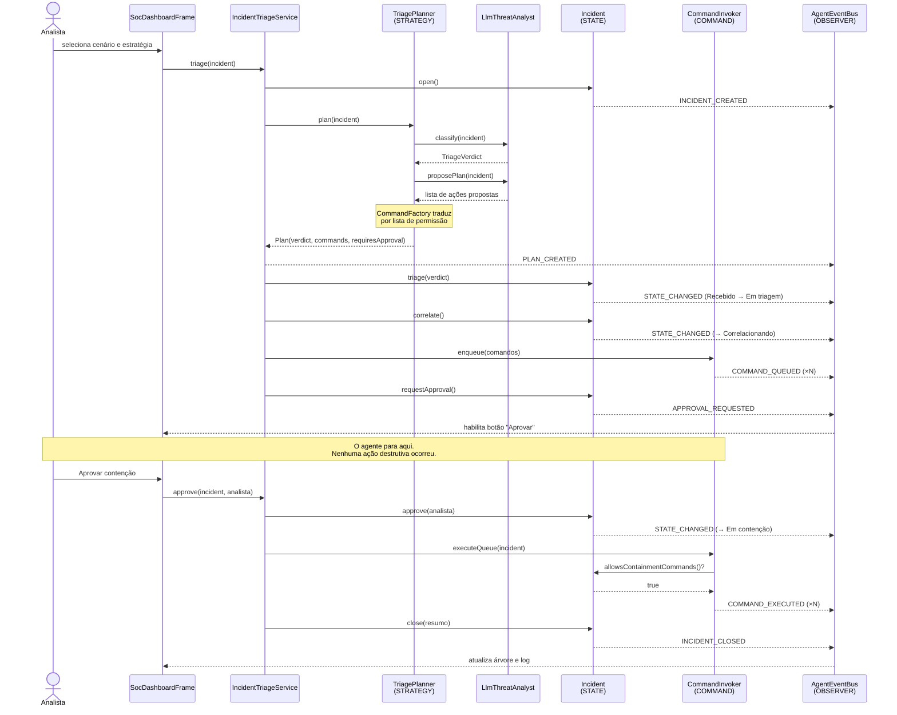

# Arquitetura e Padrões de Projeto

Agente de triagem de incidentes de segurança construído com Spring AI e modelos
abertos executados localmente via Ollama.

Categoria de caso de uso: **Security Agents** — investigar alertas, correlacionar
eventos e acionar contenção, com governança estrita e aprovação humana
obrigatória para ações críticas.

---

## 1. Visão geral em camadas



**Regra de dependência:** o núcleo de domínio não conhece Spring AI, Swing nem
Ollama. As setas para a infraestrutura atravessam interfaces (`ThreatAnalyst`,
`ContainmentGateway`), o que permite testar todos os padrões sem modelo e sem
rede — os 24 testes automatizados rodam offline.

---

## 2. Onde cada padrão está

| Padrão | Pacote | Papel na arquitetura |
|---|---|---|
| **State** | `state` | Ciclo de vida do incidente; barra ação destrutiva antes da aprovação |
| **Command** | `command` | Cada ação de resposta como objeto: enfileirável, auditável, reversível |
| **Strategy** | `strategy` | Três políticas de planejamento intercambiáveis em tempo de execução |
| **Observer** | `observer` | Difusão de eventos para auditoria, console e painel |
| **Composite** | `gui.tree` | Árvore de evidências exibida na GUI |

---

## 3. STATE — ciclo de vida do incidente

### 3.1 Diagrama de classes



**Decisão de projeto.** Todas as operações são declaradas na interface com
implementação padrão que lança `IllegalTransitionException`. Cada estado
concreto sobrescreve **apenas** o que permite. Consequência: transição ilegal
deixa de ser um `if` espalhado pelo serviço e passa a ser impossível por
construção. Não existe nenhum `switch` sobre a fase no código — acrescentar
uma fase significa criar uma classe, sem tocar no `Incident`.

### 3.2 Diagrama de máquina de estados



---

## 4. COMMAND — ações de resposta



**Três decisões que valem a defesa oral:**

1. **Comandos são código Java, nunca texto gerado pelo modelo.** O modelo
   escolhe *qual* comando invocar e com *quais parâmetros*; o que cada comando
   faz é fixado em tempo de compilação.
2. **A barreira de aprovação vive no `CommandInvoker`, não em cada comando.**
   Um comando novo já nasce protegido — não há como esquecer de checar.
3. **`undo()` é ação compensatória real.** Reverter uma contenção equivocada
   rápido vale tanto quanto aplicá-la; `IsolateHostCommand.undo()` reconecta o
   host de fato.

---

## 5. STRATEGY — políticas de planejamento



**`HumanInTheLoopPlanner` é Strategy que também decora** — envolve outro
planejador e força aprovação sem duplicar a lógica de planejamento.

**`CommandFactory` é o único ponto onde saída de modelo vira ação**, e opera por
lista de permissão. Um modelo que alucine `delete_all_logs` não encontra
tradutor: a ação é descartada com registro em log. Existe teste automatizado
para esse caso.

**`ReActPlanner` executa apenas comandos de leitura durante o ciclo** e acumula
os destrutivos para depois da aprovação. Sem essa separação, o ciclo adaptativo
contornaria a barreira de governança.

---

## 6. OBSERVER — difusão de eventos



**Falha de um observador nunca interrompe a difusão para os demais.** Em
segurança, perder a trilha de auditoria por causa de um erro de renderização na
GUI seria inaceitável — o barramento captura a exceção, registra e continua.

A estrutura usa `CopyOnWriteArrayList` porque a GUI se inscreve pela *Event
Dispatch Thread* do Swing enquanto o agente publica de uma thread de trabalho.

---

## 7. COMPOSITE — árvore de evidências na GUI



Estrutura produzida em tempo de execução:

```
+ INC-0001 | Encerrado | host WKS-4471 [CRITICAL]
  + [ALR-1001] Volume de saída 480 MB para destino externo (suricata) [CRITICAL]
    - IP: 185.220.101.7 [CRITICAL]
  + [ALR-1002] Conexão TLS com certificado autoassinado (zeek) [HIGH]
    - IP: 185.220.101.7 [HIGH]
    - PROCESS: rundll32.exe [HIGH]
  + Técnicas MITRE ATT&CK [MEDIUM]
    - T1041 - Exfiltration Over C2 Channel (Exfiltration) [MEDIUM]
  + Veredito: TRUE_POSITIVE (confiança 0,90) [INFO]
    - <justificativa produzida pelo modelo> [INFO]
  + Decisão humana [INFO]
    - Aprovado por demo.operador [INFO]
```

**As operações recursivas são métodos padrão da interface**, então folha e
composto respondem identicamente a `leafCount()`, `highestSeverity()`,
`depth()` e `render()`. A severidade agrega de baixo para cima: um grupo
marcado como `LOW` contendo um IOC `CRITICAL` aparece como `CRITICAL` no
painel, sem que ninguém recalcule isso manualmente.

**A folha recusa filhos** lançando `UnsupportedOperationException`. É a variante
*transparente* do padrão descrita no GoF: interface uniforme, com a segurança
verificada em tempo de execução.

---

## 8. Fluxo completo — diagrama de sequência



O ponto central do diagrama é a pausa antes da aprovação. Se o analista negar,
`deny()` leva direto a `CLOSED` e a fila **nunca** é executada.

---

## 9. Verificação da barreira de governança

Dois mecanismos independentes protegem a mesma invariante — nenhuma ação
destrutiva sem decisão humana:

| Camada | Mecanismo | Teste |
|---|---|---|
| State | `AwaitingApprovalState` é a única porta para `CONTAINING` | `IncidentStateTest.contencaoExigeAprovacao` |
| Command | `CommandInvoker` recusa comando aprovável fora da fase de contenção | `CommandInvokerTest.recusaSemAprovacao` |

A redundância é intencional: se um planejador futuro esquecer de marcar
`requiresApproval`, o State ainda barra; se um estado novo permitir a transição
por engano, o Invoker ainda recusa.

---

## 10. Padrões adicionais presentes

Além dos cinco exigidos, a arquitetura usa:

- **Decorator** — `HumanInTheLoopPlanner` envolve outro planejador
- **Factory** — `CommandFactory` traduz sugestão em comando por lista de permissão
- **Repository** — `MitreRepository` encapsula a base ATT&CK
- **Ports and Adapters** — `ThreatAnalyst` e `ContainmentGateway` isolam modelo e infraestrutura
- **Injeção de dependência** — todos os componentes são beans Spring
